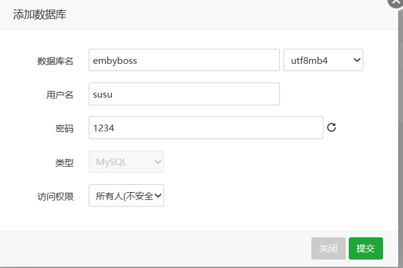
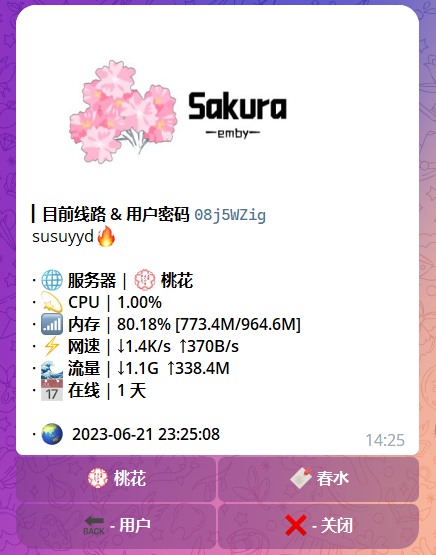

# Sakura_embyboss（体验版）


## 项目说明

- 本项目是 **业余选手** 写就，期间参考多位朋友的代码。结合一些我所认为优质的特点、元素，截至目前已有三个面板，若干命令
- 没有系统的学习代码，在逻辑上会比较乱包括很多的方面其实并不完美，但是能跑
- 推荐使用 Debian 11 搭建，比较兼容
- 解决不了大的技术问题，如需要，请自行fork修改

## 待办

- [ ] 推送相关
    - [ ] 添加排行榜推送[EmbyTools](https://github.com/Nolovenodie/EmbyTools)
    - [ ] 添加Emby中的更新推送
    - [ ] 添加收藏影片推送?
- [ ] 趣味功能
    - [ ] 积分红包
    - [ ] 公告功能(群发信息)
    - [ ] 重新启用签到?
- [ ] 基本功能  
  已实现的基础功能请看使用帮助
    - [ ] 重新绑定账户/ 用于被tg注销时不丢失emby
    - [ ] 添加邀请功能
    - [x] 支持docker部署

## 使用帮助

- [部分效果图和命令大全看这里](https://telegra.ph/embyboss-05-29)
- 在telegram中，默认的命令符为`/`，但是为避免群聊中普通成员乱点，embyboss将命令符多添加三种  
  即命令使用 ：`/start = .start = #start = !start = 。start`   快来试试吧，另外请给bot开好删除消息权限。
- 已实现初始化命令加载，无需手动添加

说明：  
start - 包括：注册，重置密码，显示或隐藏内容，删除账号  
kk - 含赠送注册、禁用账户、删除账户  
config - 含查看日志，修改探针，购买按钮,emby_line，设置显示/隐藏库（nsfw）等  
其他命令具体使用可通过其回复方法查看。

## 配置说明

- 写的有点乱，慢慢看。不解释。

### 1、拉取代码

- 下载源码到本地。然后切到文件目录中给main.py加上可执行权限，安装需要的依赖。

```
sudo apt install python3-pip
git clone https://github.com/berry8838/Sakura_embyboss.git && cd Sakura_embyboss && chmod +x main.py
```

---------------------

### 2、配置数据库

- 有两种方式配置数据库。分别说，任选一种
- 使用以下数据库管理软件均布置在 vps 上，若本地有管理软件可替代，就不用搭建了。

#### 配置数据库 (1)

- 用docker-compose一步到位。
  如果你还没有安装docker、docker compose，下面是安装步骤：

```shell
curl -fsSL https://get.docker.com | bash -s docker
curl -L "https://github.com/docker/compose/releases/download/v2.10.0/docker-compose-$(uname -s)-$(uname -m)" -o /usr/local/bin/docker-compose
chmod +x /usr/local/bin/docker-compose

systemctl start docker 
systemctl enable docker
```

- 接着在Sakura_embyboss目录下面找到文件`docker-compose.yml`，修改成自己的设置后保存。
- 在Sakura_embyboss目录运行命令`docker-compose up -d`。
- 下载[此处文件](https://github.com/berry8838/Sakura_embyboss/blob/master/_mysql/embyboss.sql)，打开你的phpmyadmin 即 ip:
  port ,点开表 embyboss，点击导入刚刚下载的文件。  
  
- 搭建完成之后，用 `ip:端口` 访问、管理

#### 配置数据库（2）

- 在你已经拥有宝塔面板前提下使用宝塔面板
- 在宝塔中，安装好mysql，phpmyadmin，进入`数据库` 新增加一个数据库，用户名密码设置，进行相应的替换，访问点击 `phpmyadmin`  
  
- 下载[此处文件](https://github.com/berry8838/Sakura_embyboss/blob/master/_mysql/embyboss.sql)，直接在面板数据库中导入这份文件
  

------------------

### 3、配置文件填写

- 打开文件`config_example.json`，参考下列说明填写自己的内容（bot，数据库，emby等等）
- 填写完整以后改名成`config.json`
- 必填项目

```
"bot_name": ""    bot的username，比如我的机器人@keaiji1_bot，就填keaiji1_bot
"bot_token": ""   bot的API token
"owner_api": ""   你的api  https://my.telegram.org/auth
"owner_hash": ""  你的hash  https://my.telegram.org/auth
"owner":          拥有者的tgid

"group": []       授权群组id (如 -1001869392674)，未授权的群组拉bot会自动退出。不在群组的成员会提示先加入群组

"main_group":""   你群组的用户名或者你私密群组的邀请链接，没有的话就随便填个 Google.com 吧  
                  如 https://t.me/+7ZL9MbJd8h44Zjc1 中的 "+7ZL9MbJd8h44Zjc1"
                  
"chanel": ""      你频道username (不加@)，没有的话就随便填个 Google.com 吧

"bot_photo":     "https://telegra.ph/file/1437f7f348c6c71f0b9ab.png",
                  bot发送消息时的图，必要
                  
"admins": []      拥有管理权限的id 1661037800 记得要填入owner里的tgid，其他添加id要用英文逗号隔开

"emby_api": ""    emby的api，在后台自己创建一个
"emby_url": ""    建议ip，http://255.255.255.36:8096 最后不带斜杠，是发送给enby的网址，填域名请保证反代不会挂
"line": ""        展示给用户的emby地址

"db_host": ""     如上，数据库的ip 如：255.255.255.36 不需要3306端口，默认的
"db_user": "susu" 数据库用户名
"db_pwd": "1234"  密码
"db": "embyboss"  库名
```

- 不填项目

```
"user_buy": "n" 开启购买按钮，建议默认关闭，可在bot里自行配置
"open": "n",    是否开启自由注册。
"buy": [],      购买按钮的样式，不填，等bot起来去里面设置。报错很麻烦
"invite": "n",  没写好，可以忽略
"block":[]      不填，确保有这个字段就行。等bot起来去里面设置
"tz": "",       探针地址，形如：https://xx.xx.xyz或http://25.25.25.25:8008 最后不带斜杠
"tz_api": "",
"tz_id": []     tz开头的三项是和 nezha 探针在一起的项目，没有哪吒探针就忽略。
"ranks": {
    "logo": "SAKURA",  日榜/周榜推送榜单图片中的LOGO文字
    "backdrop": true   是否使用backdrop作为推送榜单的封面图
}
```

- 额外的：如果你希望你的【服务器】可以显示多机器的话，探针就有用了，api生成在nezha的管理后台，id也是
  

------------

### 4、启动bot (两种方式)

#### 一、docker

- cd（切换） 到 文件目录 Sakura_embyboss，运行下面

```shell
docker run -it --name sakura_embyboss -d --restart=always -v ./config.json:/app/config.json -v ./log:/app/log jingwei520/sakura_embyboss:latest
```

#### 二、普通

- 依赖
  `pip3 install -r requirements.txt`

- 在`embyboss.service`
  里面编辑我中文标注的3行,默认可以分别填入`embyboss`，`/root/Sakura_embyboss/` ,`/root/Sakura_embyboss/main.py`
- 若有修改路径请按照自己的修改填写
- 保存后运行 `mv embyboss.service /usr/lib/systemd/system`
- 以下是控制命令

```
systemctl daemon-reload
启动bot
systemctl start embyboss
bot状态
systemctl status embyboss
重启bot
systemctl restart embyboss
开机自启
systemctl enable embyboss
停止bot
systemctl stop embyboss
```

## 感谢（排序不分先后）

- [Pyrogram • 一个现代、优雅和异步的MTProto API框架](https://github.com/pyrogram/pyrogram)
- [Nezha探针 • 自托管、轻量级、服务器和网站监控运维工具](https://github.com/naiba/nezha)
- [小宝 • 按钮风格](https://t.me/EmbyClubBot)
- [MisakaF_Emby • 使用EMBY API的方法](https://github.com/MisakaFxxk/MisakaF_Emby)
- [xiaocao • service写法](https://github.com/xiaocao666tzh/EmbyBot)
- [待定 Nolovenodie • 海报推送](https://github.com/Nolovenodie/EmbyTools)
- [折花 • 日榜周榜推送设计图](https://github.com/U41ovo)


